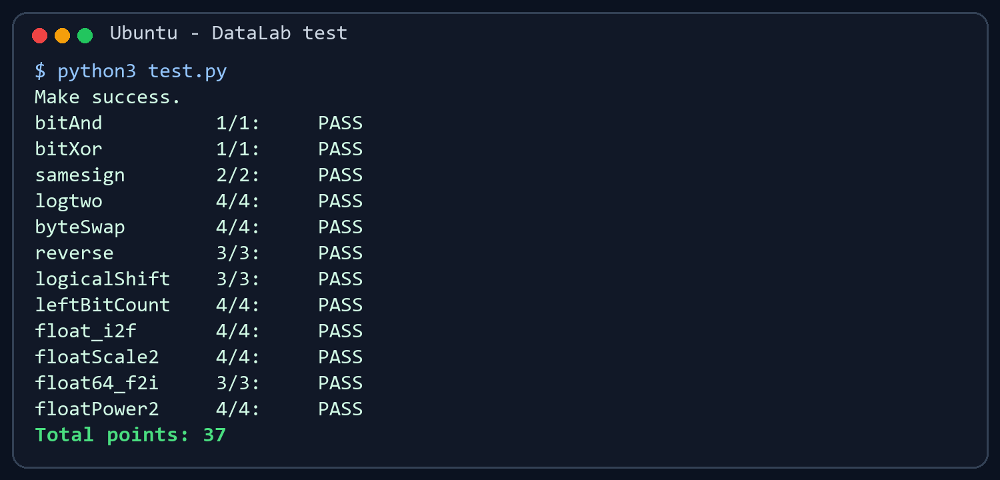

# DataLab 实验报告

姓名：刘韬  
学号：2025201694

## 实验结果

| 项目 | 得分 |
| --- | ---: |
| bitAnd | 1/1 |
| bitXor | 1/1 |
| samesign | 2/2 |
| logtwo | 4/4 |
| byteSwap | 4/4 |
| reverse | 3/3 |
| logicalShift | 3/3 |
| leftBitCount | 4/4 |
| float_i2f | 4/4 |
| floatScale2 | 4/4 |
| float64_f2i | 3/3 |
| floatPower2 | 4/4 |
| **总分** | **37/37** |

完整测试中，所有函数的正确性、合法运算符和最大操作次数检查均通过。

## 解题思路

### bitAnd

利用德摩根律把按位与转换成按位取反和按位或：先分别取反，再按位或，最后整体取反。

### bitXor

异或表示“两个对应位不同”。用两个数同时为 1、同时为 0 的情况构造结果，并只使用 `~` 和 `&` 完成转换。

### samesign

先单独处理 0，因为 0 既不是正数也不是负数。对于两个非零整数，比较最高符号位是否相同即可。

### logtwo

正整数的向下取整二进制对数等于最高位 1 的位置。依次检查高 16、8、4、2、1 位，通过分段移位快速确定位置。

### byteSwap

先计算两个字节对应的移位量，取出目标字节。将两个字节异或得到差异掩码，再把该掩码放回两个位置，从而完成交换。

### reverse

循环 32 次，每次取出输入的最低位，并把它追加到结果的右端；随后输入右移一位，最终得到完全倒序的位串。

### logicalShift

C 语言对有符号负数右移时可能在左侧补 1。因此先进行右移，再构造一个高位为 0 的掩码，清除算术右移补入的 1。

### leftBitCount

把问题转换为从最高位开始分段判断。依次检查前 16、8、4、2、1 位是否全为 1，并根据检查结果左移待测数据、累加计数。

### float_i2f

先提取符号并计算绝对值，再寻找最高位 1 来确定指数。尾数超过 23 位时，按照 IEEE 754 的“舍入到最接近的偶数”规则处理被舍弃的部分。

### floatScale2

分别处理 NaN/无穷大、非规格化数和规格化数。非规格化数将有效部分左移；规格化数增加指数，并对溢出到无穷大的情况单独处理。

### float64_f2i

从双精度浮点数的高 32 位提取符号和指数，并用高、低两部分尾数组合出整数有效位。指数过小返回 0，超出 32 位整数范围返回 `0x80000000`。

### floatPower2

根据指数范围分三种情况构造结果：过小返回 0，较小时生成非规格化数，正常范围写入偏置指数，过大则返回正无穷。

## 亮点

1. `logtwo` 和 `leftBitCount` 使用分段判断代替逐位循环，减少了操作次数。
2. `float_i2f` 对截断部分进行了舍入到偶数处理，并考虑了尾数进位。
3. 所有函数均通过题目规定的运算符合法性和最大操作次数检查。

## 收获与总结

本实验让我更加熟悉了补码、符号位、逻辑移位和算术移位的区别，也理解了 IEEE 754 单精度与双精度浮点数中符号、指数和尾数的组织方式。实现时不仅要保证结果正确，还要在有限运算符和操作次数内表达算法，因此需要从二进制表示本身出发思考。

## 参考资料

1. 课程提供的 DataLab README 与测试程序。
2. Randal E. Bryant、David R. O'Hallaron，《深入理解计算机系统》，数据表示相关章节。
